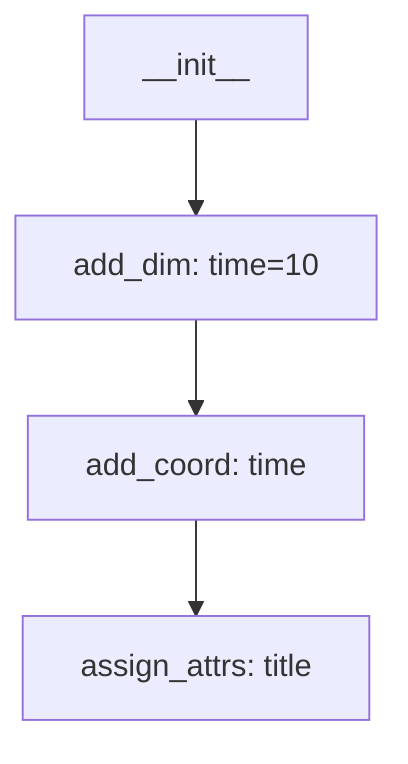

# History Tracking

dummyxarray automatically tracks all operations performed on datasets, enabling reproducible workflows and dataset provenance.

## Overview

Every operation on a `DummyDataset` is automatically recorded, including:
- Dataset initialization
- Adding dimensions, coordinates, and variables
- Setting attributes
- Renaming operations
- And more...

This history can be:
- **Exported** as Python code, JSON, or YAML
- **Visualized** as text, DOT graphs, or Mermaid diagrams
- **Replayed** to recreate datasets
- **Reset** to start tracking from a clean state

## Basic Usage

### Getting History

```python
from dummyxarray import DummyDataset

ds = DummyDataset()
ds.add_dim("time", 10)
ds.add_coord("time", dims=["time"], attrs={"units": "days"})
ds.assign_attrs(title="My Dataset")

# Get the operation history
history = ds.get_history()
print(history)
```

Output:
```python
[
    {'func': '__init__', 'args': {}},
    {'func': 'add_dim', 'args': {'name': 'time', 'size': 10}},
    {'func': 'add_coord', 'args': {'name': 'time', 'dims': ['time'], 'attrs': {'units': 'days'}}},
    {'func': 'assign_attrs', 'args': {'title': 'My Dataset'}}
]
```

## Exporting History

### As Python Code

Export history as executable Python code:

```python
python_code = ds.export_history('python')
print(python_code)
```

Output:
```python
ds = DummyDataset()
ds.add_dim(name='time', size=10)
ds.add_coord(name='time', dims=['time'], attrs={'units': 'days'})
ds.assign_attrs(title='My Dataset')
```

### As JSON

```python
json_history = ds.export_history('json')
print(json_history)
```

### As YAML

```python
yaml_history = ds.export_history('yaml')
print(yaml_history)
```

## Visualizing History

### Text Format

```python
print(ds.visualize_history(format='text'))
```

Output:
```
Dataset Construction History
============================
1. __init__()
2. add_dim(name='time', size=10)
3. add_coord(name='time', dims=['time'], attrs={'units': 'days'})
4. assign_attrs(title='My Dataset')

Summary:
  Total operations: 4
  Operation breakdown:
    __init__: 1
    add_dim: 1
    add_coord: 1
    assign_attrs: 1
```

### DOT Format (Graphviz)

Generate a graph visualization:

```python
dot_graph = ds.visualize_history(format='dot')
print(dot_graph)

# Save to file and render
with open('history.dot', 'w') as f:
    f.write(dot_graph)

# Render with: dot -Tpng history.dot -o history.png
```

### Mermaid Format

Generate a Mermaid diagram (works in GitHub, GitLab, documentation):

```python
mermaid_diagram = ds.visualize_history(format='mermaid')
print(mermaid_diagram)
```

Output:


## Replaying History

### From History List

Recreate a dataset from its history:

```python
# Get history from original dataset
history = ds.get_history()

# Create new dataset by replaying history
new_ds = DummyDataset.replay_history(history)

# Verify they're equivalent
assert new_ds.dims == ds.dims
assert new_ds.attrs == ds.attrs
```

### From JSON/YAML

```python
# Export history
json_history = ds.export_history('json')

# Later, replay from JSON string
recreated_ds = DummyDataset.replay_history(json_history)
```

### Use Cases for Replay

1. **Version Control** - Store history in git, replay to recreate datasets
2. **Documentation** - Include history in papers/reports
3. **Debugging** - Replay to understand how a dataset was created
4. **Templates** - Share dataset creation workflows

## Provenance Tracking

Track what changed in each operation:

```python
ds = DummyDataset()
ds.add_dim("time", 10)
ds.add_coord("time", dims=["time"])
ds.rename_dims(time="t")

# Get provenance information
provenance = ds.get_provenance()
print(provenance)
```

Output:
```python
[
    {
        'index': 1,
        'func': 'add_dim',
        'provenance': {'added': ['time']}
    },
    {
        'index': 2,
        'func': 'add_coord',
        'provenance': {'added': ['time']}
    },
    {
        'index': 3,
        'func': 'rename_dims',
        'provenance': {
            'renamed': {'time': 't'},
            'removed': ['time'],
            'added': ['t']
        }
    }
]
```

### Visualizing Provenance

```python
# Compact view
print(ds.visualize_provenance(format='compact'))

# Detailed view
print(ds.visualize_provenance(format='detailed'))
```

## Resetting History

Start fresh while keeping the current dataset state:

```python
# Create dataset with many operations
ds = DummyDataset()
ds.add_dim("time", 10)
ds.add_dim("lat", 64)
ds.add_coord("time", dims=["time"])
# ... many more operations ...

# Reset history
ds.reset_history()

# Now history only contains __init__
print(len(ds.get_history()))  # 1

# New operations are tracked from this point
ds.add_variable("temp", dims=["time", "lat"])
print(len(ds.get_history()))  # 2
```

### When to Reset

- After importing from xarray
- When starting a new workflow phase
- To simplify history for documentation
- Before sharing templates

## Complete Example

```python
from dummyxarray import DummyDataset

# Create dataset with tracked operations
ds = DummyDataset()
ds.assign_attrs(Conventions="CF-1.8", title="Temperature Data")

ds.add_dim("time", 12)
ds.add_dim("lat", 64)
ds.add_dim("lon", 128)

ds.add_coord("time", dims=["time"], attrs={"units": "days since 2000-01-01"})
ds.add_coord("lat", dims=["lat"], attrs={"units": "degrees_north"})
ds.add_coord("lon", dims=["lon"], attrs={"units": "degrees_east"})

ds.add_variable(
    "temperature",
    dims=["time", "lat", "lon"],
    attrs={"standard_name": "air_temperature", "units": "K"}
)

# Export history as Python code
python_code = ds.export_history('python')
with open('create_dataset.py', 'w') as f:
    f.write(python_code)

# Visualize history
print(ds.visualize_history(format='text'))

# Save history as JSON for version control
import json
history = ds.get_history()
with open('dataset_history.json', 'w') as f:
    json.dump(history, f, indent=2)

# Get provenance information
provenance = ds.get_provenance()
print(f"\nTotal operations with provenance: {len(provenance)}")
print(f"Items added: {sum(len(p['provenance'].get('added', [])) for p in provenance)}")
```

## History for DummyArray

Individual arrays also track their history:

```python
from dummyxarray import DummyArray

arr = DummyArray(dims=["time"], attrs={"units": "K"})
arr.assign_attrs(long_name="Temperature", standard_name="air_temperature")

# Get array history
history = arr.get_history()
print(history)

# Replay array history
new_arr = DummyArray.replay_history(history)
```

## Best Practices

1. **Export history regularly** - Save to version control
2. **Use meaningful operation names** - Makes history easier to understand
3. **Reset after imports** - Clean history when importing from xarray
4. **Visualize for documentation** - Include Mermaid diagrams in docs
5. **Replay for testing** - Verify dataset creation is reproducible
6. **Track provenance** - Understand what changed and when

## Advanced: Custom History Recording

History recording can be disabled:

```python
# Create dataset without history tracking
ds = DummyDataset(_record_history=False)

# No history is recorded
ds.add_dim("time", 10)
print(ds.get_history())  # None
```

This can be useful for:
- Performance-critical code
- Temporary datasets
- Internal operations

## Next Steps

- Learn about [CF Compliance](cf-compliance.md) validation
- See [Examples](../examples.md) for history tracking workflows
- Check the [API Reference](../api/dataset.md) for all history methods
